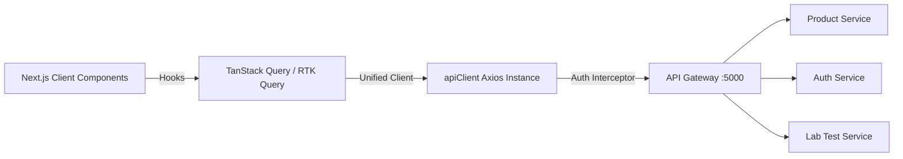

# 🏥 CareHub Frontend Architecture & Engineering Master Audit
> **Project:** `apps/client` (Microservice AI-Powered Healthcare Platform)  
> **Date:** September 2026  
> **Author:** Antigravity Engineering System  

---

## 📊 1. Overall Score Card & Executive Summary

| Category | Current Score | Target Grade | Key Observations & Bottlenecks |
| :--- | :---: | :---: | :--- |
| **Architecture & Structure** | **5.5 / 10** | **9.5 / 10** | Monolithic client components, scattered Axios calls, duplicate API instances. |
| **UI & UX Design** | **5.0 / 10** | **9.0 / 10** | Hardcoded layout positions (e.g. `left-[980px]`), missing empty/loading skeletons, lack of micro-animations. |
| **TypeScript Strictness** | **4.0 / 10** | **9.5 / 10** | Excessive usage of `any` (`useState<any>`, `items: any`), missing unified DTOs/interfaces. |
| **Accessibility (WCAG 2.1)** | **4.0 / 10** | **9.0 / 10** | Missing ARIA labels on icon buttons, low color contrast (`text-[12px]` in light gray), unsemantic elements. |
| **API & Data Fetching** | **5.0 / 10** | **9.5 / 10** | Uncoordinated `FormData` vs JSON requests, manual token management in local storage, missing caching layer. |
| **State Management** | **4.5 / 10** | **9.0 / 10** | Prop drilling, disparate state for Cart, Auth, and Products across separate pages. |
| **SEO & Meta Strategy** | **3.0 / 10** | **9.5 / 10** | Missing dynamic metadata, Open Graph cards, structured JSON-LD data for medical products. |
| **Automated Testing** | **1.0 / 10** | **9.0 / 10** | Zero unit/integration tests with Jest/RTL; zero E2E tests with Playwright/Cypress. |
| **OVERALL SYSTEM MARK** | **4.5 / 10** | **9.3 / 10** | **Functional Early-Stage Foundation. Ready for Enterprise-Grade Refactor.** |

---

## 🎨 2. UI / UX Design System & Visual Excellence

### Current Issues:
1. **Fragile Layouts:** Elements use static absolute/relative margins (e.g. `relative left-[980px]` in `cart/page.tsx`), breaking immediately on tablets and smaller screens.
2. **Lack of Feedback States:** No optimistic UI updates during "Add to cart" or "Quantity increase/decrease"; uses native browser `alert()` instead of modern toast notifications.
3. **Skeleton Loading:** Entire page flips between raw spinners and rendered content rather than fluid shimmer skeletons.

### Implementation Checklist:
* [ ] **Design Tokens:** Replace ad-hoc colors with Tailwind CSS / CSS variables (Primary: Teal/Emerald `#0ea5e9`, `#059669`; Neutral Dark: `#0f172a`).
* [ ] **Toast Notifications:** Implement `sonner` or `react-hot-toast` for cart additions, errors, and auth alerts.
* [ ] **Skeletons:** Create reusable `<ProductCardSkeleton />` and `<CartItemSkeleton />`.
* [ ] **Responsive Grid Layout:** Use CSS Grid `grid grid-cols-1 lg:grid-cols-12 gap-6` for Cart and Products layout.

---

## ♿ 3. Accessibility (WCAG 2.1 AA) Standards

| WCAG 2.1 Rule | Current State | Enterprise Fix |
| :--- | :--- | :--- |
| **1.1.1 Non-text Content** | `Image` components have placeholder `alt="pics"` | Dynamic descriptive alt tags: `alt={product.name}` |
| **1.3.1 Info & Relationships** | Unsemantic `<div>` buttons | Proper `<button>` tags with `type="button"` |
| **2.1.1 Keyboard Navigation** | Search and icon buttons not focusable with Tab/Enter | Accessible `<button aria-label="Search tests">` with visible `:focus-visible` outlines |
| **1.4.3 Minimum Contrast** | Light orange text on white backgrounds | Ensure 4.5:1 contrast ratio for body text, 3:1 for large headers |
| **4.1.2 Name, Role, Value** | Counter buttons (`+`, `-`) have no screen-reader context | Add `aria-label="Increase quantity of [Product]"` |

---

## 🌐 4. API Layer & Data Fetching Architecture

### Current Problems in Codebase:
* Direct `axios.post` in `productService.ts` creating separate headers and `FormData` on every single call instead of utilizing centralized [apiClient.ts](file:///c:/Users/ADMIN/Desktop/Microservice-Ai-Powered-Healthcare/apps/client/src/services/apiClient.ts).
* Manual retrieval of `localStorage.getItem("userAccessToken")` in 20+ service functions.
* Lack of automated request cancellation (`AbortController`), retry mechanisms, or client-side caching (TanStack React Query / RTK Query).

### Recommended Architecture:


---

## 🏷️ 5. TypeScript Strictness & Type Safety

### Anti-Pattern: Ubiquitous `any`
```typescript
// ❌ Current Anti-Pattern:
const [cartData, setCartData] = useState<any>([])
const cartAdds = async (id: any, quantity: any) => { ... }
```

### Enterprise Standard: Typed Domain Models
```typescript
// ✅ Enterprise Implementation:
export interface IProduct {
  _id: string;
  name: string;
  price: number;
  description?: string;
  image: string[];
  variant?: string;
  stock: number;
  brandId?: { _id: string; name: string };
  categoryId?: { _id: string; name: string };
}

export interface ICartItem {
  _id: string;
  userId: string;
  productId: IProduct;
  quantity: number;
  itemTotalPrice: number;
  createdAt: string;
  updatedAt: string;
}

export interface ICartResponse {
  success: boolean;
  message: string;
  totalCartPrice: number;
  totalCartQuantity: number;
  data: ICartItem[];
}
```

---

## 🔍 6. SEO Master Guide (Metadata, Open Graph, Structured Data)

### 6.1 Dynamic Metadata & Open Graph (`app/(site)/buy-medicines/details/[id]/page.tsx`)
```typescript
import type { Metadata, ResolvingMetadata } from 'next';

type Props = {
  params: { id: string };
};

export async function generateMetadata(
  { params }: Props,
  parent: ResolvingMetadata
): Promise<Metadata> {
  const product = await fetchProductById(params.id);

  return {
    title: `${product.name} - Buy Online | CareHub Healthcare`,
    description: product.description?.slice(0, 160) || 'Buy genuine healthcare medicines online.',
    openGraph: {
      title: product.name,
      description: product.description,
      images: [{ url: product.image[0] || '/default-product.png', width: 800, height: 600 }],
      type: 'website',
      siteName: 'CareHub Healthcare',
    },
    twitter: {
      card: 'summary_large_image',
      title: product.name,
      images: [product.image[0]],
    },
    alternates: {
      canonical: `https://carehub.com/buy-medicines/details/${params.id}`,
    },
  };
}
```

### 6.2 Structured Data (Schema.org JSON-LD for Medical Products)
```tsx
export function ProductJsonLd({ product }: { product: IProduct }) {
  const jsonLd = {
    '@context': 'https://schema.org',
    '@type': 'Product',
    name: product.name,
    image: product.image,
    description: product.description,
    offers: {
      '@type': 'Offer',
      price: product.price,
      priceCurrency: 'INR',
      availability: product.stock > 0 ? 'https://schema.org/InStock' : 'https://schema.org/OutOfStock',
    },
  };

  return (
    <script
      type="application/ld+json"
      dangerouslySetInnerHTML={{ __html: JSON.stringify(jsonLd) }}
    />
  );
}
```

### 6.3 Technical SEO Files
* **`app/sitemap.ts`**: Automatically indexes all products, lab tests, and doctor profiles for Google/Bing crawlers.
* **`app/robots.ts`**: Controls crawler accessibility and links the sitemap index.

---

## 🧪 7. Testing Master Plan (Jest, RTL, MSW, Playwright)

### 7.1 Testing Pyramid Breakdown
1. **Unit & Component Testing (Jest + React Testing Library):** Tests isolated components like Buttons, Skeletons, Navbar, and Cart Items.
2. **API Mock Testing (Mock Service Worker - MSW):** Intercepts API requests at the network level during test execution without hitting live databases.
3. **End-to-End (E2E) Testing (Playwright / Cypress):** Simulates a complete user journey (Login -> Search Medicine -> Add to Cart -> Checkout).

### 7.2 Component Test Example (`CartItem.test.tsx`)
```tsx
import { render, screen, fireEvent } from '@testing-library/react';
import { CartItemCard } from './CartItemCard';

const mockItem = {
  _id: 'cart-123',
  quantity: 2,
  itemTotalPrice: 500,
  productId: { _id: 'prod-1', name: 'Paracetamol 500mg', price: 250, image: ['/test.png'] }
};

describe('CartItemCard Component', () => {
  it('renders product details and calculates item price correctly', () => {
    render(<CartItemCard item={mockItem} onRemove={jest.fn()} onUpdateQty={jest.fn()} />);
    
    expect(screen.getByText('Paracetamol 500mg')).toBeInTheDocument();
    expect(screen.getByText('₹ 500.00')).toBeInTheDocument();
  });

  it('triggers remove handler when clicked', () => {
    const handleRemove = jest.fn();
    render(<CartItemCard item={mockItem} onRemove={handleRemove} onUpdateQty={jest.fn()} />);
    
    fireEvent.click(screen.getByRole('button', { name: /remove cart/i }));
    expect(handleRemove).toHaveBeenCalledWith('cart-123');
  });
});
```

### 7.3 Playwright E2E Test Example (`cart-flow.spec.ts`)
```typescript
import { test, expect } from '@playwright/test';

test('User can browse medicine, add to cart, and view in cart page', async ({ page }) => {
  await page.goto('/buy-medicines');
  await page.fill('input[placeholder="Search"]', 'Paracetamol');
  await page.click('text=View details');
  
  await expect(page).toHaveURL(/\/buy-medicines\/details\//);
  await page.click('button:has-text("Add to cart")');
  
  await page.click('button:has-text("Cart")');
  await expect(page).toHaveURL('/cart');
  await expect(page.locator('text=Total Price')).toBeVisible();
});
```

---

## ⚡ 8. State Management: Redux Toolkit vs Zustand

### Where should Redux Toolkit (RTK) / Zustand be used?
* **Global Auth Session:** User/Doctor profile, token status, permissions.
* **Persistent Cart State:** Floating cart count in Navbar, offline cart synchronization, quick price recalculation.
* **Global Notifications / Modals:** Toast queues, confirmation dialogs.

### Redux Toolkit (RTK) Cart Slice Example
```typescript
import { createSlice, PayloadAction } from '@reduxjs/toolkit';
import { ICartItem } from '../types/cart.types';

interface CartState {
  items: ICartItem[];
  totalPrice: number;
  totalQuantity: number;
  loading: boolean;
}

const initialState: CartState = {
  items: [],
  totalPrice: 0,
  totalQuantity: 0,
  loading: false,
};

export const cartSlice = createSlice({
  name: 'cart',
  initialState,
  reducers: {
    setCart: (state, action: PayloadAction<{ items: ICartItem[]; totalCartPrice: number; totalCartQuantity: number }>) => {
      state.items = action.payload.items;
      state.totalPrice = action.payload.totalCartPrice;
      state.totalQuantity = action.payload.totalCartQuantity;
    },
    optimisticRemoveItem: (state, action: PayloadAction<string>) => {
      state.items = state.items.filter((item) => item._id !== action.payload);
      state.totalPrice = state.items.reduce((sum, item) => sum + item.itemTotalPrice, 0);
      state.totalQuantity = state.items.reduce((sum, item) => sum + item.quantity, 0);
    },
  },
});

export const { setCart, optimisticRemoveItem } = cartSlice.actions;
export default cartSlice.reducer;
```

---

## 🪝 9. Master React Hooks Guide (All 13 Hooks: Before vs After)

---

### 1. `useState`
* **Before (Scattered, Unsafe State):**
```tsx
const [cartData, setCartData] = useState<any>([])
const [loading, setLoading] = useState<Boolean>(false)
const [dirData, setDirData] = useState<any>()
```
* **After (Strongly Typed, Unified State):**
```tsx
interface CartUIState {
  items: ICartItem[];
  totalCartPrice: number;
  totalCartQuantity: number;
  isLoading: boolean;
  error: string | null;
}

const [cartState, setCartState] = useState<CartUIState>({
  items: [],
  totalCartPrice: 0,
  totalCartQuantity: 0,
  isLoading: true,
  error: null,
});
```

---

### 2. `useEffect`
* **Before (Missing Cleanup & Potential Race Conditions):**
```tsx
useEffect(() => {
  list() // If user navigates away, request continues and sets state on unmounted component
}, [])
```
* **After (Abort Controller Cleanup):**
```tsx
useEffect(() => {
  const controller = new AbortController();

  async function loadCart() {
    try {
      const response = await fetchCartData({ signal: controller.signal });
      setCartState((prev) => ({ ...prev, ...response, isLoading: false }));
    } catch (err: any) {
      if (err.name !== 'CanceledError') {
        setCartState((prev) => ({ ...prev, error: err.message, isLoading: false }));
      }
    }
  }

  loadCart();
  return () => controller.abort(); // Prevents memory leak
}, []);
```

---

### 3. `useRef`
* **Before (Direct DOM Query or Missing Element Focus):**
```tsx
// Using document.getElementById or missing focus control
<input id="search-input" />
```
* **After (Safe Ref for Keyboard Shortcuts / Auto Focus):**
```tsx
const searchInputRef = useRef<HTMLInputElement>(null);

useEffect(() => {
  // Focus search bar on keyboard shortcut (Ctrl + K / Cmd + K)
  const handleKeyDown = (e: KeyboardEvent) => {
    if ((e.ctrlKey || e.metaKey) && e.key === 'k') {
      e.preventDefault();
      searchInputRef.current?.focus();
    }
  };
  window.addEventListener('keydown', handleKeyDown);
  return () => window.removeEventListener('keydown', handleKeyDown);
}, []);

<input ref={searchInputRef} placeholder="Search medicines (Ctrl + K)" />
```

---

### 4. `useContext`
* **Before (Prop Drilling Tokens & User Details):**
```tsx
// Passing user auth info through Navbar -> Dropdown -> ProfileButton
```
* **After (Dedicated Auth & Theme Context):**
```tsx
interface AuthContextType {
  user: IUser | null;
  isAuthenticated: boolean;
  login: (token: string) => void;
  logout: () => void;
}

const AuthContext = createContext<AuthContextType | undefined>(undefined);

export const useAuth = () => {
  const context = useContext(AuthContext);
  if (!context) throw new Error('useAuth must be used within an AuthProvider');
  return context;
};
```

---

### 5. `useReducer`
* **Before (Multiple Independent State Triggers Leading to Inconsistencies):**
```tsx
// Updating quantity, price, discount, and coupon in separate setStates
setCart(newItems);
setTotal(newTotal);
setDiscount(newDiscount);
```
* **After (Predictable State Machine):**
```tsx
type CartAction =
  | { type: 'SET_CART'; payload: ICartResponse }
  | { type: 'UPDATE_QTY'; payload: { id: string; qty: number } }
  | { type: 'REMOVE_ITEM'; payload: string };

function cartReducer(state: CartState, action: CartAction): CartState {
  switch (action.type) {
    case 'REMOVE_ITEM': {
      const filtered = state.items.filter((i) => i._id !== action.payload);
      return {
        ...state,
        items: filtered,
        totalCartPrice: filtered.reduce((acc, item) => acc + item.itemTotalPrice, 0),
      };
    }
    default:
      return state;
  }
}

const [state, dispatch] = useReducer(cartReducer, initialState);
```

---

### 6. `useMemo`
* **Before (Recalculating Filtering on Every Single Render):**
```tsx
// In buy-medicines/page.tsx:
const filterProduct = productLists.filter((items: any) => 
  items.name.toLowerCase().includes(search.toLowerCase())
);
```
* **After (Memoized Expensive Calculations):**
```tsx
const filteredProducts = useMemo(() => {
  if (!search.trim()) return productLists;
  const query = search.toLowerCase();
  return productLists.filter((product) =>
    product.name.toLowerCase().includes(query) ||
    product.brandId?.name.toLowerCase().includes(query)
  );
}, [productLists, search]);
```

---

### 7. `useCallback`
* **Before (Recreating Functions on Every Render, Causing Child Re-renders):**
```tsx
// Recreated on every keystroke, causing child buttons to re-render
const removeItems = async (id: any) => {
  await cartDelete(id);
  list();
};
```
* **After (Stable Function Reference for Memoized Components):**
```tsx
const handleRemoveItem = useCallback(async (cartId: string) => {
  try {
    await cartDelete(cartId);
    dispatch({ type: 'REMOVE_ITEM', payload: cartId });
    toast.success('Item removed from cart');
  } catch (err: any) {
    toast.error(err.message || 'Failed to remove item');
  }
}, []);
```

---

### 8. `useLayoutEffect`
* **Use Case:** Preventing visual flickering when measuring DOM dimensions or scroll position before browser paint.
```tsx
useLayoutEffect(() => {
  // Sync scroll or tooltip positioning before screen paint
  const navbar = document.querySelector('header');
  if (navbar) {
    setNavHeight(navbar.getBoundingClientRect().height);
  }
}, []);
```

---

### 9. `useImperativeHandle`
* **Use Case:** Exposing custom imperative methods (like `.clear()`, `.focus()`, or `.validate()`) from a child component to a parent ref.
```tsx
export interface SearchInputHandle {
  resetSearch: () => void;
  focusInput: () => void;
}

const SearchBar = forwardRef<SearchInputHandle, SearchBarProps>((props, ref) => {
  const inputRef = useRef<HTMLInputElement>(null);

  useImperativeHandle(ref, () => ({
    resetSearch: () => {
      if (inputRef.current) inputRef.current.value = '';
    },
    focusInput: () => {
      inputRef.current?.focus();
    },
  }));

  return <input ref={inputRef} {...props} />;
});
```

---

### 10. `useTransition`
* **Use Case:** Keeping UI interactive while processing non-urgent state updates (e.g. searching through 5,000+ medicines without lagging user typing).
```tsx
const [isPending, startTransition] = useTransition();
const [searchTerm, setSearchTerm] = useState('');
const [deferredQuery, setDeferredQuery] = useState('');

const handleSearchChange = (e: React.ChangeEvent<HTMLInputElement>) => {
  // Urgent update: Update input immediately
  setSearchTerm(e.target.value);

  // Non-urgent update: Filter medicine list in background
  startTransition(() => {
    setDeferredQuery(e.target.value);
  });
};
```

---

### 11. `useDeferredValue`
* **Use Case:** Deferring the rendering of complex list trees until higher priority animations or inputs complete.
```tsx
const [search, setSearch] = useState('');
const deferredSearch = useDeferredValue(search);

// Passes deferred query to child without freezing the input
<MedicineSearchResults query={deferredSearch} />
```

---

### 12. `useId`
* **Use Case:** Generating unique, accessible IDs for form inputs and ARIA descriptors (guarantees no SSR/hydration mismatches).
```tsx
function AccessibleInputField({ label, ...props }: { label: string }) {
  const id = useId();
  return (
    <div>
      <label htmlFor={id} className="block text-sm font-medium">{label}</label>
      <input id={id} aria-describedby={`${id}-hint`} {...props} />
    </div>
  );
}
```

---

### 13. Custom Hooks (`useCart`, `useDebounce`, `useLocalStorage`)

#### `useDebounce.ts` (Optimizes search API calls)
```typescript
import { useState, useEffect } from 'react';

export function useDebounce<T>(value: T, delay = 300): T {
  const [debouncedValue, setDebouncedValue] = useState<T>(value);

  useEffect(() => {
    const handler = setTimeout(() => setDebouncedValue(value), delay);
    return () => clearTimeout(handler);
  }, [value, delay]);

  return debouncedValue;
}
```

#### `useCart.ts` (Encapsulates all Cart API operations)
```typescript
import { useQuery, useMutation, useQueryClient } from '@tanstack/react-query';
import { cartList, cartAdd, cartDelete, cartUpdate } from '../services/productService';

export const CART_QUERY_KEY = ['cart'];

export function useCart() {
  const queryClient = useQueryClient();

  const cartQuery = useQuery({
    queryKey: CART_QUERY_KEY,
    queryFn: cartList,
    staleTime: 1000 * 60 * 2, // 2 minutes
  });

  const addToCartMutation = useMutation({
    mutationFn: ({ productId, quantity }: { productId: string; quantity: number }) =>
      cartAdd(productId, quantity),
    onSuccess: () => {
      queryClient.invalidateQueries({ queryKey: CART_QUERY_KEY });
    },
  });

  const removeFromCartMutation = useMutation({
    mutationFn: (cartId: string) => cartDelete(cartId),
    onSuccess: () => {
      queryClient.invalidateQueries({ queryKey: CART_QUERY_KEY });
    },
  });

  return {
    cart: cartQuery.data?.data,
    totalCartPrice: cartQuery.data?.totalCartPrice || 0,
    totalCartQuantity: cartQuery.data?.totalCartQuantity || 0,
    isLoading: cartQuery.isLoading,
    addToCart: addToCartMutation.mutateAsync,
    removeFromCart: removeFromCartMutation.mutateAsync,
  };
}
```

---

## 🚀 10. Step-by-Step Implementation Roadmap

| Phase | Milestone & Focus Area | Target Outcome |
| :--- | :--- | :--- |
| **Phase 1** | **Type Safety & API Unification** | Migrate all `any` to strict interfaces in `types/`. Unify Axios in `apiClient.ts`. |
| **Phase 2** | **React Query & State Overhaul** | Wrap data fetching with TanStack Query / RTK Query. Implement `useCart` hook. |
| **Phase 3** | **UI/UX & Mobile Responsiveness** | Remove hardcoded pixel offsets (`left-[980px]`). Add Skeleton loaders & Toast system. |
| **Phase 4** | **SEO & OpenGraph Integration** | Add `generateMetadata`, JSON-LD Schema markup, `sitemap.ts`, and `robots.ts`. |
| **Phase 5** | **Automated Testing Suite** | Configure Jest + RTL for components; write Playwright test for critical cart checkout flow. |
